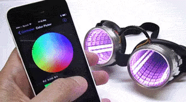
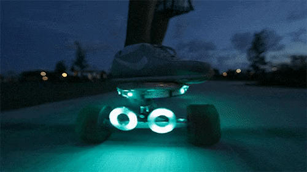
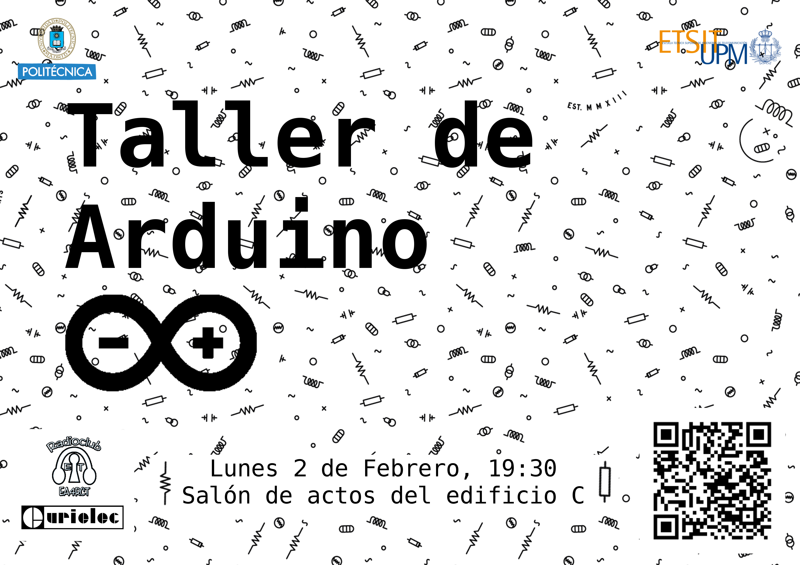

 Lunes 2 de Febrero del 2018 / ETSIT UPM

# BORRADOR DE LA ACTIVIDAD

  
  
  

### DESCRIPCIÓN

Taller de introducción a [Arduino](https://www.arduino.cc/), las placas de desarrollo libres, baratas y enfocadas a la educación.

Se comenzará desde el nivel más básico, por lo que no será necesario **ningún conocimiento de programación o electrónica para asistir**, es más, aquellos que hayan trabajado con arduino seguramente se aburran.

---

### ¿DE QUÉ HABLAREMOS?

Arduino, también conocido como **Genunino** en Europa, es una placa programable barata, fácil y **libre**, que nos permitirá hacer cosas muy chulas con unos pocos detalles de programación y electrónica que aprenderemos en el propio taller.

Durante el taller veremos como hacer pequeños circuitos y como controlarlos con unas pocas lineas de programación. Será un taller puramente práctico y sencillo, lleno de ejemplos para que rápidamente podáis hacer vuestros propios experimentos.

Llevaremos varios kits de desarrollo para los asistentes, pero se agradece que los que dispongáis de uno propio también lo llevéis por si faltan para otros participantes.

Hará falta un ordenador, a ser posible con el programar Arduino instalado.

---

### PROGRAMA

[Hora por concretar esto es solo un borrador]

| 19:00-19:15   | Presentaciones de los asistentes  |
| 19:15-19:45   | Introducción teórica |
| 19:45-19:50 	| Cacharreo |

---

### DESPUÉS DEL EVENTO

Tras la jornada es habitual que parte del grupo nos vayamos de tapeo por las cercanías, perfecto para ir conociéndonos más entre nosotros.

---

### Localizacion

Lugar: <strong><a href="sitio">Salón de actos del edificio C, ETSIT UPM, Madrid</a></strong>, {{page.locality}}.

Fecha: <strong>Lunes 2 de Febrero del 2018</strong>

Hora: <strong>de 19:30 a 21:00</strong>

---

