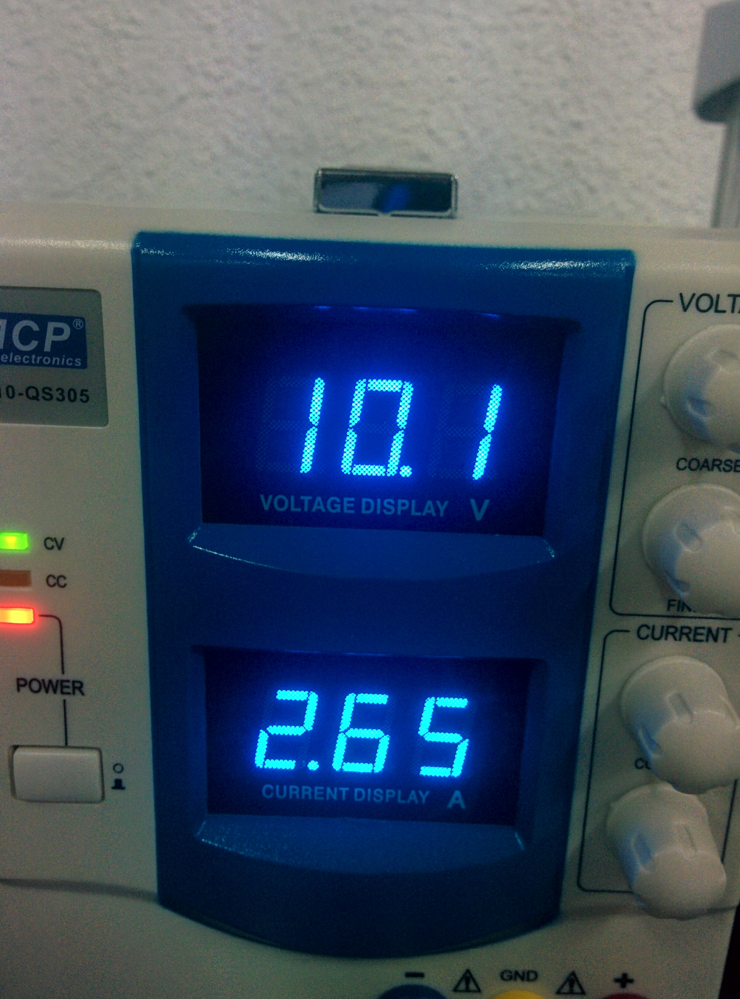
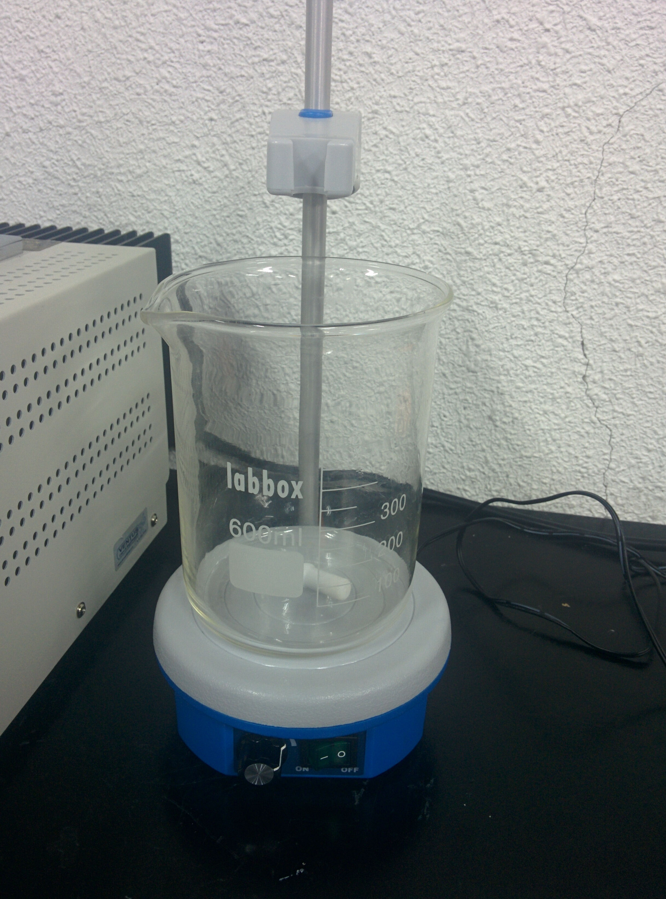
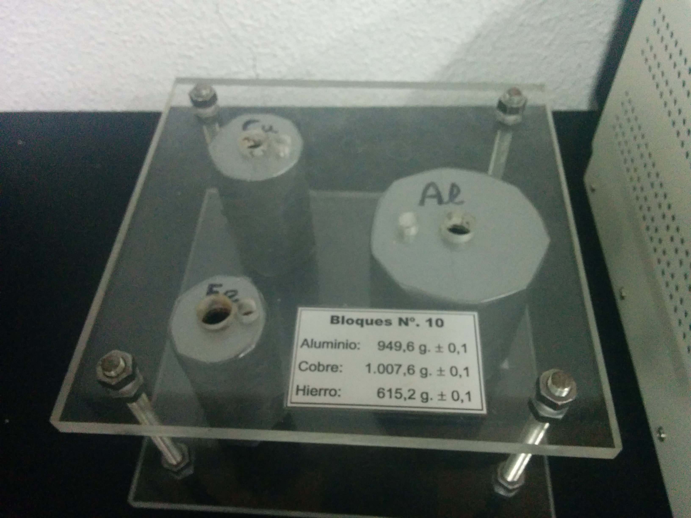
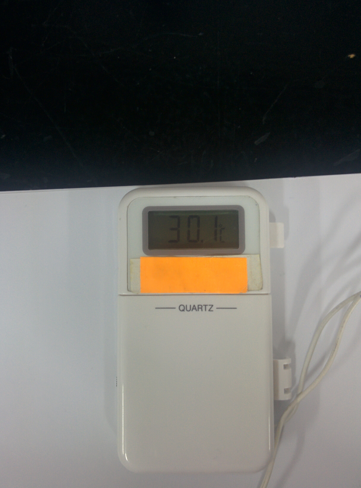

Esta práctica consistirá en determinar los calores específicos de diferentes sustancias. El material proporcionado es el siguiente:
* Agitador magnético con un vaso de precipitado
* Fuente de alimentación con un barra metálica para aplicar calor
* Termómetro
* Diferentes sustancias en unos recipientes metálicos

Los objetivos de la prática para las sustancias de Cobre, Hierro, Aluminio y Agua:
* Determinar el error cometido al medir la temperatura, la energía aportada y las masas.
* Realizar de calor y temperatura
* Razonar el comportamiento de la curva
* Determinar la pendiente mediante un ajuste por mínimos cuadrados, y determinar su error cuadrático médio.
* Determinar el error de los calores absolutos con sus errores absolutos. Comparar estas medidas con los valores reales.

### Agua
#### Planteamiento
Primero vamos a empezar con el agua. Los pasos seguidos han sido:
1. Primero cogemos el vaso de precipitado y lo llenamos de **agua del grifo**. Lo llenamos con unos **400 ml**.
2. Introducimos la barra metálica de la fuente de alimentación y el termómetro.
3. Encendemos el agitador para asegurarnos de que la temperatura será constante en todo el recipiente.
2. Encendemos la **fuente de alimentación** y la ponemos a **11 Voltios a 2.90 Amperios**.
3. Tomamos los valores de temperatura cada **30 segundos**.

En las primeras iteraciones del experimento pudimos notar que el agua varía de temperatura muy lento, del órden de 0.3ºC/0.5ºC. Por lo que tomar valores cada 30 segundos sería más que suficiente. Además, tendremos que tener el experimento el tiempo suficiente cómo para que la variación de temperatura sea grande, esta variación debería de ser de 20ºC a 50ºC para tener una gama amplia de datos.

La temperatura del agua del grifo inicialmente es de 23.3ºC, y el agua empieza a hervir a los 90ºC. Con lo que un buen volumen de datos sería llegar a los 40ºC/ 50ºC.

#### Realización

Al realizar la prueba, **cogimos datos durante 870 segundos desde una temperatura inicial de 23.3ºC hasta los 35.7ºC**. Los datos se encuentran [aquí](../data/aguaexp.json) y su gráfica sería:

### Cobre
#### Planteamiento
#### Realización

### Aluminio
#### Planteamiento
#### Realización

### Hierro
#### Planteamiento
#### Realizacion

