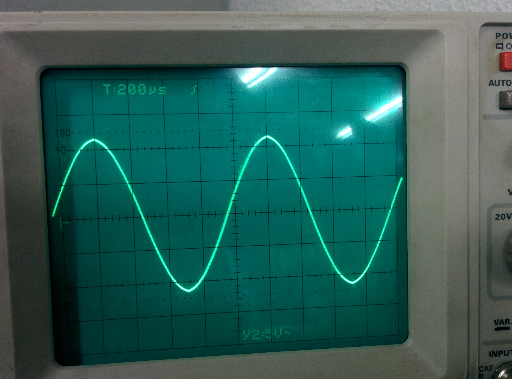
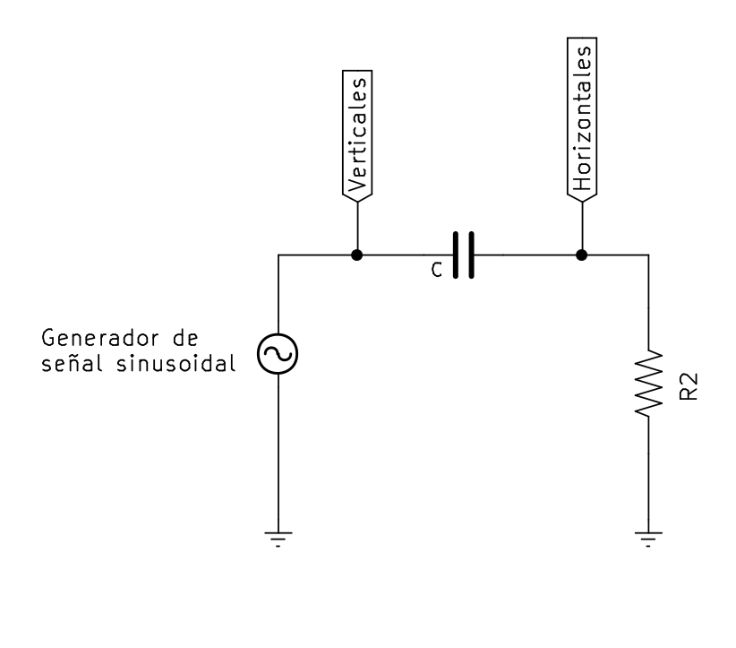
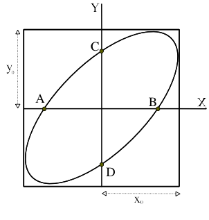

Esta práctica consistirá en el manejo del osciloscopio, de cómo funciona un oscilador, comparación de frecuencias (Figuras de Lissajous) y de la medida de una diferencia de fase.

El material proporcionado es el siguiente:
* Osciloscopio de rayos catódichos
* Generador de señal sinusoidal
* Oscilador problema
* Panel con resistencias y condensadores

### Práctica

La práctica se divide en 3 bloques:
1. Manejo del osciloscopio:
  Conectar la salida del generador de ondas al del osciloscopio y poner una determinada frecuencia y medir:
  * La tensión pico-pico
  * Frecuencia de la onda con su error y comparar con la del generador de ondas.
2. Figuras de Lissajouse:
  Conectar la **salida del oscilador problema al eje X del osciloscopio** y conectar la **salida del generador de ondas al eje Y del osciloscopio**, y determinar:
  * Determinar la frecuencia del oscilador problema, utilizando las relaciones siguientes: 1:2, 3:1, 2:3 (\\(\omega_x : \omega_y\\)).
  * ¿Qué error se comete en la medida de la frecuencia problema, teniendo en cuenta el error del generador de señal variable?
3. Conectamos el circuito de un filtro paso alto (vease más tarde) y medir la diferencia de fase por el método de la elipse:
    * De las resistencias disponibles, elegir un valor adecuado para medir fácilmente el desfase. Calcular el error en la medida del desfase.
    * Teniendo en cuenta: \\(tg \Lambda = 1/ 2 \pi f RC\\) Calcular el valor de la resistencia tomada y su error.

### Primer bloque: Manejo del osciloscopio

La teoría del funcionamiento del osciloscopio se pasa por alto, sino [aquí](https://es.wikipedia.org/wiki/Osciloscopio) una gran explicación.

#### Procedimiento
Conectamos la salida del generador de ondas al del osciloscopio. El **generador de ondas** la vamos a poner **a una frecuencia de 1KHz** y a una amplitud de onda, de primeras, desconocida.

Al conectar, lo que vemos por la pantalla del oscilocopio es lo siguiente:

De primeras podemos ver diferentes datos que nos van a ser de utilidad para los próximos apartados. Primero, nos encontramos que abajo nos indica *Y2:5V~*, esto quiere decir, que la señal está en el canal 2 y que por cada cuadrante hay una diferencia de potencia de **5 V**. Segundo, arriba vemos que pone *T:200  	µs*, que se refiere a que se hace **un barrido cada 200 µs**. Esto se puede cambiar con un potenciometro, lo ponemos como nos sea más útil trabajar.

#### Determinar tensión pico-pico

Para determinar la tensión pico-pico lo único que tenemos que hacer es contar cuadraditos. **La señal utilizada no es la de la foto anterior, es otra**. En este caso, cada cuadradito tiene un valor de **5 V**, y la onda **desde pico a pico** tiene **4 cuadrantes**. Cada cuadrito está dividido en 5, con lo que su error es del 20%, para cada uno:  

$$

V_{onda} = 4 \cdot 5 = 20 \quad V

\qquad

\Delta V_{cuadrante} = 1 \quad V

\\

\Rightarrow V_{onda} = 20 \pm 1 \quad V
$$

#### Frecuencia de la onda y comparar con la que da el generador de señales

Para determinar la frecuencia de la señal también tenemos que contar cuadraditos. **La señal utilizada no es la de la foto anterior, es otra**. En este caso, cada barrido se hace cada \\(T: 500 \mu s\\). El error es el mismo que anteriormente, cada cuadradito está dividido en 5, con lo que su error es del 20%, para cada uno.

La onda **se repite cada \\(T_{onda} = 1000 \mu s\\)**. Para determinar su frecuencia, que es la inversa del periodo:

$$

f_{onda} = \frac{1}{T_{onda}} = \frac{1}{1000 \cdot 10^{-6}} = 1000 \quad Hz

\\

\Delta T_{onda} = 100 \quad \mu s

\\

\Delta f_{onda} = \Bigg \lvert \frac{\delta f_{onda}}{\delta T_{onda}} \Bigg \lvert \Delta T_{onda} = \frac{1}{T_{frac}^{2}} \cdot \Delta T_{onda} = 100 \quad Hz

\\

\Rightarrow f_{onda} = 1000 \pm 100 \quad Hz

$$

Por otro lado, el **generador de onda** nos pone que la **onda generada es de 1 KHz**. Además nos lo da con una precisión de 0.01 KHz ya que el indicador digital nos pone 2 decimales para el KHz, es decir \\(\Delta f_{generador} = 10 Hz\\).  

Comparando los dos resultados, tiene sentido el resultado con los aparatos.

### Segundo bloque: Figuras de Lissajouse

El oscilador problema, arriba una foto, es uno del que no tenemos ninguna información de su frecuencia, mas que su *output*. En esta parte vamos a determinar su frecuencia a partir de las figuras de Lissajouse.

#### Procedimiento

Conectamos la salida del oscilador problema al eje X del osciloscopio y conectamos la salida del generador de ondas al eje Y del osciloscopio. Configuramos el osciloscopio en XY con los dos canales.

#### Determinar frecuencia del oscilador
De primeras ya empezamos a ver las curvas de Lissajouse así que el montaje está correcto, pero no en las frecuencias deseadas.

Las curvas de Lissajouse se generan al tener dos frecuecias. Cuando una es proporción de la otra (vease figura de arriba) genera un dibujo determinado. Con el generador de ondas nos vamos moviendo por su frecuencia hasta encontrar las diferentes relaciones de:  1:2, 3:1, 2:3 (\\(\omega_x, \omega_y\\))

Los resultados, encontrando las curvas de Lissajouse han sido las siguiente:

Relacion | Frecuencia [KHz] | Curva
--- | --- | ---
1:2 | 1.70 | 
1:3 | 2.55 | 
2:3 | 1.28 | 

Con esta información llegamos a la conclusión de que la frecuencia del oscilador problema es de \\(f_{oscilador} = 0.85 KHz\\).

#### Error en la medida

### Tercer bloque: Medida de diferencia de fase por el método de la eclipse

Se monta el circuito siguiente:

Se trata de un filtro paso alto, que se rige por la siguiente ecuación de transferecia:

$$

H(s = j\omega) = \frac{s}{s + 1/RC} \qquad \omega_c = \frac{1}{RC}

\\

\Rightarrow H(s = j\omega) = \frac{s}{s + \omega_c}

$$

Siendo su fase la siguiente:

$$

\phi(\omega) = Arg(s) - Arg(s + \omega_c) = tg\bigg(\frac{\omega}{0}\bigg) - tg\bigg(\frac{1/RC}{\omega}\bigg)

\\

\Rightarrow tg(\varphi) = \frac{1}{\omega RC} = \frac{1}{2\pi fRC}

$$

De acuerdo con el método de la eclipse:

El desfase \\(\varphi\\) se puede calcular a partir de:

$$

sen \ \varphi = \frac{AB}{2 x_0}

$$

o bien

$$

sen \ \varphi = \frac{CD}{2 y_0}

$$

#### Valor adecuado de resistencias y calcular el error de la medida del desfase

El **valor del condensador** de es \\(C = 100 nF\\). Hemos puesto el **generador de onda a** \\(f = 270 Hz\\). Las diferentes resistencias de la placa son de: \\(330 \Omega\\), \\(10K \Omega\\) y \\(1K \Omega\\):

$$

R = 330 \Omega \Rightarrow \varphi = tg^{-1} \frac{1}{2\pi fRC} = tg^{-1}\frac{1}{2\pi \ 270 \ 330 \ 100\cdot 10^{-9}} = 9.63 º

\\

R = 10K \ \Omega \Rightarrow \varphi = tg^{-1} \frac{1}{2\pi fRC} = tg^{-1}\frac{1}{2\pi \ 270 \ 10000 \ 100\cdot 10^{-9}} = 30.52º

\\

R = 1K \ \Omega \Rightarrow \varphi = tg^{-1} \frac{1}{2\pi fRC} = tg^{-1}\frac{1}{2\pi \ 270 \ 1000 \ 100\cdot 10^{-9}} = 80.37 º

$$

De las resistencias disponibles el mejor valor para tomar la medida es la de \\(R = 10 K \ \Omega\\) porque las otras el desfase o muy poco, en el de \\(330 \Omega\\), o es demasiado, en el de \\(1K \ \Omega\\). Así la elipse no estará demasiada *achatada* ni demasiado *alargada*, y podremos tomar las medidas de forma más exacta.

La **resistencia tomada tiene una tolerancia del** 5%, es decir que su valor es de \\(R = 10K \pm 500 \ \Omega\\).

Con esa resistencia, la elipse por pantalla es la siguiente:

Se puede observar que: \\(AB = 2, \ x_0 = 2 \\).Para determinar su fase con las ecuaciones anteriores:

$$

sen \ \varphi =  \frac{2}{2 \cdot 2} = \frac{1}{2}

\\

\varphi = sen^{-1} \frac{1}{2} = 30º

$$

Cada cuadrante está separado por 5 marcas, es decir que el error de medida del osciloscopio es de \\(\pm 0.2\\). Para calcular su error:

$$

\Delta \varphi = \Bigg \lvert \frac{\delta \varphi}{\delta AB} \Bigg \lvert \Delta AB + \Bigg \lvert \frac{\delta \varphi}{\delta x_0} \Bigg \lvert \Delta x_0 = \frac{\Delta AB}{2 x_0} + \frac{AB \Delta x_0}{2 x^2_0} = 0.1 \quad rad

$$

Entonces llegamos a la conclusión de que:

$$

\varphi = 30º \pm 5.7º

$$

#### Calcular el error de la resistencia tomada y su error

Para calcular el valor de la resitencia valor a utilizar la expresión anterior y el valor de \\(\varphi\\):

$$

tg \ \varphi = \frac{1}{2\pi fRC} \Rightarrow R = \frac{1}{2 \pi \ f \ C \ tg \ \varphi}

\\

R = \frac{1}{2 \pi \ 270 \ 100 \cdot 10^{-9} \ 0.58} = 10209.8 \ \Omega

$$

El **error de f** es de 10 Hz, como dijimos anteriormente. El **error de C no lo sabemos** por lo que suponemos que no tiene error. Para calcular su error:

$$

\Delta R = \bigg \lvert \frac{\delta R}{\delta f} \bigg \lvert \Delta f +  
\bigg \lvert \frac{\delta R}{\delta tg \ \varphi} \bigg \lvert \Delta tg     \ \varphi =  \frac{\Delta f}{2 \pi \ C \ tg \ \varphi \ f^2} + \frac{\Delta tg \ \varphi}{2 \pi \ f\ C \ (tg \ \varphi)^2} =

$$

### Bibliografía

* [https://es.wikipedia.org/wiki/Osciloscopio](https://es.wikipedia.org/wiki/Osciloscopio)
