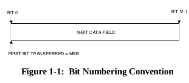

# Space Packet Protocol Specification
## Nomeclature

The first bit in the field to be transmitted (i.e., the most left justified when drawing a figure) is defined to be ‘Bit 0’; the following bit is defined to be ‘Bit 1’ and so on up to ‘Bit N–1’.When the field is used to express a binary value (such as a counter), **the Most Significant Bit(MSB) shall be the first transmitted bit of the field**, i.e., ‘Bit 0’ (see figure 1-1).

## Protocol Specifications

The Space Packet shall be a **variable-length**, delimited, octet-aligned data unit defined in section 4 of this Recommendation. It shall consist of at least 7 and at most 65542 octets, but individual project organizations may establish the maximum length used for their projects, taking into account the maximum service data unit size in all subnetworks traversed by the LDP.

They are **variable in length** (or may be fixed at the discretion of the user) and are transmitted at **variable intervals**. Aside from a header that identifies the Packet, the internal data content of Space Packets is completely under the control of the user application. Each user application can define the organization and content of Packets independently of other user applications and with a minimum of constraints imposed by the transmission mechanisms of the underlying subnetworks.

### Packet Primary Header
  
**Packet Version Number**: Binary encodede Version Number  
**Packet type**: Telemetry '0', for telecommand '1'  
**Secondary Header Flag**: '1' fi Packet Secondary Header is present, 'o' if Packet Secondaty Header is not present  
**Application process identifier**: APID may uniquely identify the individual sending or receiving application process within a particular space vehicle  
**Sequence flags**:  
* '00' if is a continuation segment of USER Data
* '01' if is the first segment of User Data
* '10' if is the last segment of User Data
* '11' if constains unsegment User Data

**Paquet Sequence Count or Packet Name**: Is a counter for sending or receiving more than one packet. Max value : 16383  
**Packet Data Length**: (Total Number of Octets in the Packet Data Field) - 1  

### Packet Data Field
#### Packet Secondary Header
If present, the packet secondary header shall follow, without gap, the packet primary Header. **The contents** shall be specified by the source end user for echad Path ID, and reported to the destination end user(s) by management.

#### User Data Field
If present, the User Data Field shall follow, without gap, either the Packet Secondary Header(if is present) or the Packet Primary Header.
Shall consist of an integral number of octets.
