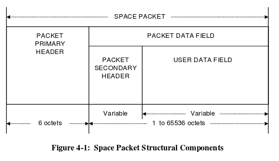
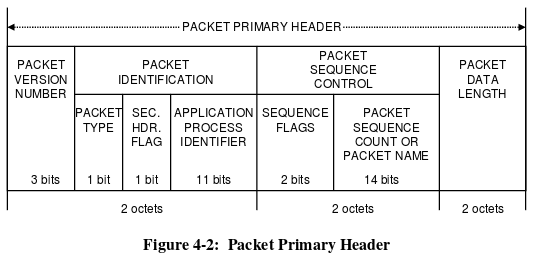
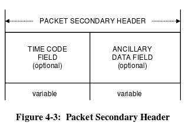

# Space Packet Protocol Specification

## Packet Primary Header
  
**Packet Version Number**: Binary encodede Version Number  
**Packet type**: Telemetry '0', for telecommand '1'  
**Secondary Header Flag**: '1' fi Packet Secondary Header is present, 'o' if Packet Secondaty Header is not present  
**Application process identifier**: APID may uniquely identify the individual sending or receiving application process within a particular space vehicle  
**Sequence flags**:  
* '00' if is a continuation segment of USER Data
* '01' if is the first segment of User Data
* '10' if is the last segment of User Data
* '11' if constains unsegment User Data

**Paquet Sequence Count or Packet Name**: Is a counter for sending or receiving more than one packet. Max value : 16383  
**Packet Data Length**: (Total Number of Octets in the Packet Data Field) - 1  

## Packet Data Field
### Packet Secondary Header
If present, the packet secondary header shall follow, without gap, the packet primary Header. **The contents** shall be specified by the source end user for echad Path ID, and reported to the destination end user(s) by management.

### User Data Field
If present, the User Data Field shall follow, without gap, either the Packet Secondary Header(if is present) or the Packet Primary Header.
Shall consist of an integral number of octets.
