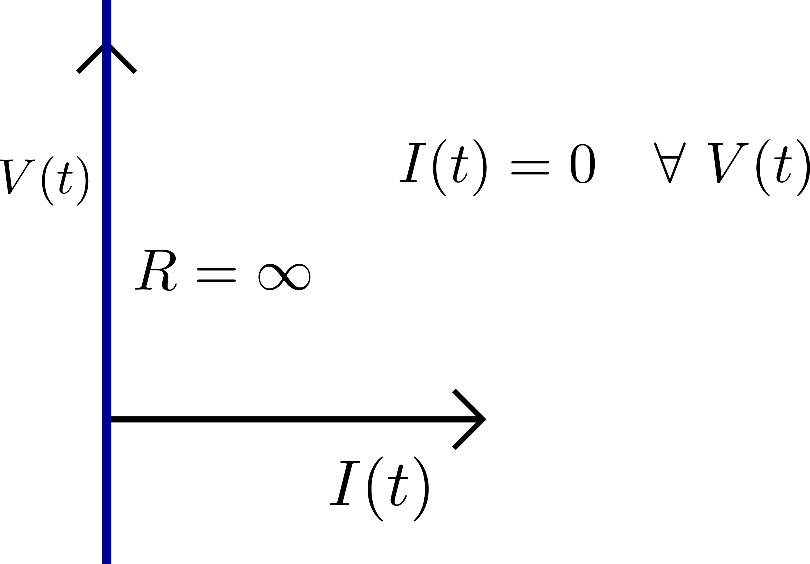

Estos van a ser una serie de artículos en los que se resume las materias del libro de examen de radioaficionados, y se amplían los conocimientos que a mi juicio son interesantes/necesarios para entender los principios de la radioafición.

### Estructura de la materia
Los átomos constan de dos partes el núcleo y la corteza. La parte central o núcleo que está cargado con carga eléctrica positiva y que se compone básicamente de **protones** (partículas con carga positiva) y **neutrones** (partículas con masa pero sin carga).

Alrededor del núcleo , existen una o más capas, cuyo conjunto se denomina corteza, donde describen órbitas a gran velocidad los **electrones** (partículas con carga negativa), como si fueran satélites que giran alrededor de un planeta.

Un **conductor** de electricidad es una sustancia compuesta por átomos cuya capa más externa no llega a estar semillena de electrones, lo que permite que existan electrones libres asegurando así el paso de la corriente.

Por el contrario, **un aislador** lo forman sustancias que presentan gran resistencia a que las cargas que las forman se desplacen y por tanto no conducen, en condiciones normales, la electricidad.

Un **semiconductor** es un elemento que se comporta como un conductor o como aislante dependiendo del campo eléctrico en el que se encuentre, como le ocurre, por ejemplo, al germanio o al silicio.

## Teoría eléctrica

### Corriente eléctrica, voltaje y resistencia

Se denomina **corriente eléctrica** al paso de electrones a lo largo de un conductor que une dos puntos con distinta carga eléctrica.

$$

i(t) = \frac{dq(t)}{dt}

$$

La tensión o **voltaje** es la presión eléctrica o diferencia del nivel de cargas que existe entre dos puntos como resultado de la presencia de una fuerza electromotriz entre ellos.

$$

v(t) = \frac{d W(t)}{dq}

$$

Siendo \\(W(t)\\) la **energía consumida** o trabajo medida en Julios.

La **potencia de disipación** se expresa como:

$$

p(t) = \frac{dW(t)}{dt} = \frac{dW(t)}{dq(t)}\frac{dq(t)}{dt} = i(t) \cdot v(t)

$$

La **energía desarrollada** E será:

$$

E = P \cdot t

$$

### Kirchhoff

##### Primera ley de Kirchhoff

En cualquier circuito formado por elementos concentrados, en cualquiera de sus nodos y en cualquier instante de tiempo, la suma algebraica de las corrientes es cero.

$$

\sum^{n}_{k = 1} i_{k} (t) = 0

$$

##### Segunda ley de Kirchhoff

En cualquier circuito formado por elementos concentrados, en cualquiera de sus lazos y en cualquier instante de tiempo la suma algebraica de tensiones es cero.

$$

\sum^{n}_{k = 1} v_{k} (t) = 0

$$

### Resistencia

#### Ley de Ohm

$$

v(t) = i(t) \cdot R

\qquad

i(t) = G \cdot v(t)
$$

Siendo **R** la resistencia medida en \\(\omega\\) ohmios, que es la inversa a la **conductancia** **G** medida en Siemens (S).

$$

G = \frac{1}{R}

$$

#### Agrupación de resistencias
##### Resistencias en serie

$$

R_{eq} = \sum^{n}_{k = 1} R_{k} = R_1 + R_2 + R_3 ...

$$

##### Resistencias en paralelo

$$

\frac{1}{R_{eq}} = \sum^{n}_{k = 1} \frac{1}{R_k} = \frac{1}{R_1} + \frac{1}{R_2} +\frac{1}{R_3} ...

$$

#### Disipación de potencia en las resistencias

En general, una **resistencia se intercala en un circuito para obstaculizar el paso de la corriente y transforma en calor el voltaje que no necesitamos en un punto dado**. Esta disipación se conoce como **efecto Joule**.

Se llama **potencia de disipación**, medida en vatios, al producto del voltaje por la intensidad que ha de circular por la resistencia:

$$

P = V \cdot I

$$

La **ley de Joule** enuncia que la cantidad de calor desprendida en un condensador por el paso de una corriente constante es proporcional al cuadrado de la intensidad de la corriente, a la resistencia del conductor y al tiempo que dure el paso:

$$

E = P \cdot t = V \cdot I \cdot t = I^2 \cdot R \cdot t

$$

La **disipación máxima** es la potencia calorífica que podemos suministrar a una resistencia sin que la temperatura se eleve peligrosamente. Los valores de disipación de potencia más frecuentes de las resistencias son las de 0.125 W, 0.25 W, 0.5 W y 1 W.

### Condensador

Un **condensador** es un elemento o componente de un circuito eléctrico que consta de dos placas conductoras separadas por un cuerpo no conductor llamado **dieléctrico**, tal como el aire, el aceite, el polietileno, etc.

Los condensadores tienen la facultad de almacenar, al paso de la corriente, cargas de distinto signo en sus placas.

La **capacidad eléctrica** (C) de un condensador es la facultad de acumular una determinada carga eléctrica a un voltaje determinado. Su elastancia es la inversa de la capacidad, \\(S = \frac{1}{C}\\)

Dejará de pasar corriente cuando exista un equilibrio de carga entre las armaduras. Los condensadores pueden cargarse hasta que entre las placas de éstos se llega a alcanzar un voltaje igual al existente en las bornas de la batería o fuente que los alimente.

Su carga eléctrica **q(t)** viene definida por:

$$

q(t) = C \cdot v(t)

\\

i(t) = \frac{dq(t)}{dt}
$$

Su corriente y tensión serán:

$$

i(t) = C \frac{dV(t)}{dt}

\\

V(t) = \frac{1}{C} \int_{-\inf}^{t} i(\tau) d\tau = \frac{1}{C} \int_{-\inf}^{0} i(\tau) d\tau + \frac{1}{C} \int_{0}^{t} i(\tau) d\tau = V(0) + \frac{1}{C} \int_{0}^{t} i(\tau) d\tau

$$

&nbsp;

Ejemplo de carga de condensador. Circuito de primer orden

 

 

Por la segunda ley de Kirchhoff, las tensiones de malla serán:

$$

\begin{cases}

  V_g = R_g \cdot i(t) + V_c(t)
  \\
  i(t) = C \frac{dVc(t)}{dt}

\end{cases}

\quad \Rightarrow V_g = R_g \ C \frac{dV_c(t)}{dt} + V_c

$$

Que es una ecuación diferencial de 1er orden. Para el caso particular de una entrada nula V_g = 0 y un condicion inicial V_c(t = 0) = V_g su solución será:

$$

V_c (t) = V_c(t = 0) \cdot e^{- \frac{t}{RC}}

$$

&nbsp;

La **energía alamacenada** en un condensador se expresa por la fórmula:

$$

W = \frac{1}{2} C V^2

$$

Denominamos **tensión de trabajo** de un condensador a aquella que puede soportar sin que se perfore su dieléctrico, lo que daría lugar a un cortocircuito entre sus placas.

##### Relación entre capacidad, dimensiones y dieléctrico
La capacidad de un condensador depende de dos magnitudes:
* La distancia entre las placas. Es inversamente proporcional.
* La constante dieléctrica del material. Es directamente proporcional.

##### Tipos de condensadores
Los ajustables o **trimmer** que se utilizan para ajustar la capacidad en ciertos circuitos.

Los **condensadores electrolíticos** tienen un dieléctrico líquido o papel impregnado en una sustancia química. Son de amplio uso y tienen polaridad.

#### Asociación de condensadores
##### Condensadores en serie

$$

\frac{1}{C_{eq}} = \sum^{n}_{k = 1} \frac{1}{C_k} = \frac{1}{C_1} + \frac{1}{C_2} +\frac{1}{C_3} ...

$$

##### Condensadores en paralelo

$$

C_{eq} = \sum^{n}_{k = 1} C_{k} = C_1 + C_2 + C_3 ...

$$

### Campo magnético
De una manera intuitiva podemos definir el campo como el espacio en el que un imán ejerce su influencia

Un **campo magnético** está constituido por **líneas de fuerza** y el número total de ellas se denomina **flujo magnético**.

La unidad del flujo magnético es el **Weber (Wb)**. La **densidad de flujo** es el **Tesla (T)**.

La **reluctancia** es la propiedad de los cuerpos de oponerse a la creación de un flujo magnético. La **permeabilidad** indica la mayor facilidad con que puede crearse un campo magnético en un cuerpo frente al esfuerzo necesario para crearlo en el aire.

### Electromagnetismo
El **electromagnetismo** es el conjunto de acciones y reacciones producidas por los campos eléctricos y magnéticos sobre la materia.

Cuando un conductor de recorre una corriente elétrica este crea un campo magnético alrededor del conductor. Su campo magnético viene determinado por la **Ley de Biot y Savart**:

$$

d\vec{B} = \frac{\mu_0}{4\pi}\frac{I \ d \vec{l} \times \hat{r}}{r^2}

$$

El campo magnético creado por un conductor recto es débil, y se puede reforzar enrollándolo en forma de bucle o espira, por ejemplo, al centrarse las líneas de fuerza en su centro. Así tendriamos una **bobina**.

### Bobinas

Una **bobina**, solenoide o inductor, es un elemento de un circuito eléctrico que, debido al fenómeno de la autoinducción, almacena energía en forma de campo magnético.

Se llama **permeabilidad** de un material a la relación entre la densidad de flujo con un núcleo de ese material y sin él.

Se llama **inductancia (L)** a la propiedad que tiene una bobina de oponerse a los cambios de la corriente que pasa a través de ella.

$$

\Phi (t) = L \cdot i(t)

\\

v(t) = \frac{d \Phi (t)}{dt}

$$

$$

v(t) = L \frac{di(t)}{dt}

\\

i(t) = \frac{1}{L}\int_{-\inf}^{t} v(\tau) d\tau =  
\frac{1}{L}\int_{-\inf}^{0} v(\tau) d\tau + \frac{1}{L}\int_{0}^{t} v(\tau) d\tau = i(0) + \frac{1}{L}\int_{0}^{t} v(\tau) d\tau

$$

La tensión en terminales de la bobina con el sentido de referencia asociado viene dada por la **ley de Faraday**.

**La ley de Lenz** establece que la fuerza electromotriz inducida (tensión) debida a la variación de flujo deber tener una polaridad que se oponga en todo momento a la causa que originó dicha variación de flujo.

#### Agrupación de bobinas
##### Bobinas en serie

$$

L_{eq} = \sum^{n}_{k = 1} L_{k} = L_1 + L_2 + L_3 ...

$$

##### Bobinas en paralelo

$$

\frac{1}{L_{eq}} = \sum^{n}_{k = 1} \frac{1}{L_k} = \frac{1}{L_1} + \frac{1}{L_2} +\frac{1}{L_3} ...

$$

#### Autoinducción

**Inducción mutua** es la que ejercen dos bobinas colocadas próximas entre sí, de tal manera que el flujo magnético de una de ellas pasa por las espiras de la otra. Si el devanado es del mismo sentido dicha inducción mutua será mayor que la suma de ambas inductancias \\(L_1\\) y \\(L_2\\); si el devanado es de sentido contrario será la inducción mutua menor que dicha suma.

#### Efecto del número de espiras, diámetro, longitud y material del núcleo
1. A mayor número de espiras mayor inductancia, y recíprocamente.
2. A espiras más juntas mayor inductancia, y recíprocamente.
3. A mayor diámetro mayor inductancia, y recíprocamente.

Al igual que en los campos eléctricos es posible aislar un espacio dado de la influencia de un campo magnético, rodeándolo completamente con un material ferromagnético.

### Corriente Alterna
La **corriente alterna** es en la que el flujo de electrones que la crea se invierte periódicamente. Estas puede tranportarse a grandes distancias fácilmente y sin grandes pérdiddas, al tiempo que puede adoptar calores grandes o pequeños de voltaje.

#### Tensión y corriente.
Una señal sinusoidal, bien sea una corriente o una tensión, se puede expresar matemáticamente como una función del tiempo por medio de la siguiente expresión:

$$

a(t) = A_0 \sin{(\omega t + \beta)}

$$

El **valor pico a pico** de una señal se define como la diferencia entre su pico o máximo positivo y su pico negativo.

El **valor eficaz (RMS)**, generalmente, es el más significatico para trabajar con señales alternas. Se defina como el correspondiente a una corriente continua que disiparía la misma cantidad de calor que la corriente alterna considerada.

$$

V_{rms} = \frac{V_pico}{\sqrt{2}} \qquad V_{pico} = V_{rms} \sqrt{2}

$$

#### Potencia de la corriente alterna
 En los circuitos de corriente alterna, en los que intervienen, además de resistencias, capacidades y/o inductancias, se producen, debido a los desfasamientos que pudieran existir, unos efectos particulares por la variabilidad de la corriente alterna. Por ello para expresar la potencia se aplica un factor de corrección denominado **factor de potencia** o coseno de \\(\phi\\) cuyo valor siempre es menor o igual que uno:

 $$

P = V \cdot I \ cdot \cos{\phi}

$$

Si la tensión e intensidad están en fase, la potencia se denomina **media** o **eficaz**. En caso de desfase se llama **real** o **activada**. La primera se mide en voltiamperios y la segunda en vatios.
