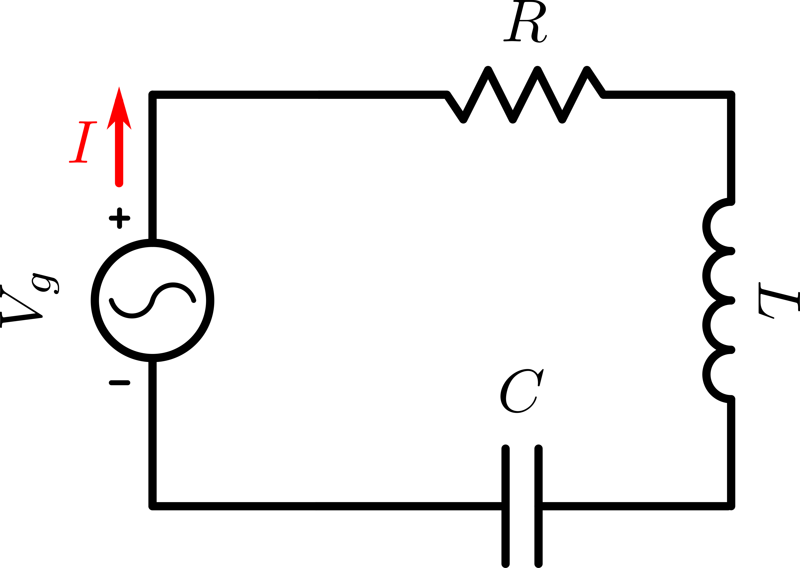

# Circuitos en corriente alterna. Filtros. Transformadores. Formas de onda no sinusoidales

### Sinusoides y fasores

Para simplificar las operaciones con sinusoides se utilizan los **fasores**. Un **fasor** es un número complejo que representa una sinusoide \\(x(t) = A \ \cos{(\omega t + \Phi)}\\).

#### Números complejo

Se define cada número complejo z como un par ordenado de números reales: z = (a, b). A su vez el primer elemento a se define como parte real de z, se denota \\( a={\text{Re}}(z)\\) \\( a={\text{Re}}(z)\\); el segundo elemento b se define como parte imaginaria de z, se denota \\( b={\text{Im}}(z)\\) \\( b={\text{Im}}(z) \\)

$$

z = x + jy

\\

x = \text{Re} [z]   \qquad y = \text{Im} [z]

$$

Los número complejos se pueden expresar en su forma trigonométrica, pues (a, b) definen unas coordenadas en el plano complejo. Si r y \\(\theta\\) son las coordenadas polares del punto (x, y) (que corresponde a un número complejo no nulo z = x + jy ), es decir \\(x = r \ \cos{\theta}\\), \\(y = r \ \sin{\theta}\\) , el número \\(z \neq 0\\) puede escribirse:

$$

z = r(\cos{\theta} + j \sin{\theta})

$$

Si \\(z = 0 \ , \ \theta\\) es indefinido.

El número positivo \\(r = \lvert z \lvert = + \sqrt{x^2 + y^2}\\) es la longitud del vector correspondiente a z.

El número \\(\theta\\) (que puede calcularse mediante la ecuación \\(\tan{\theta} = \frac{y}{v}\\) ) se llama *argumento* de z y escribimos \\(\theta = arg \ z\\). Por tanto *arg z* denota un ángulo, en radianes, que forma el vector que representa z con el eje real positivo.

##### Fórmula de Euler

$$

e^{j\theta} = \cos{\theta} + j\sin{\theta}

$$

Con lo que un número *z* en su forma exponencial:

$$

z = r(\cos{\theta} + j \sin{\theta}) = r e^{j \theta}

$$

#### Fasores

Si tenemos una onda sinusoidal, el fasor que la representa será:

$$

x(t) = A_m \sin{(\omega t + \phi)}

$$

$$

x(t) = \text{Im} [A_m(\cos{(\omega t + \phi)} + j \sin{(\omega t + \phi)})]

\\

= \text{Im} [A_m e^{j(\omega t + \phi)}] = \text{Im} [A_m e^{j \phi} e^{j \omega t}]

$$

Por tanto el fasor que representa esta sinusoide es de la forma siguiente:

$$

X = A_m e^{j \phi}

$$

Por tanto *x(t)* será de la forma:

$$

x(t) = \text{Im} [X e^{j \omega t}]

$$

Por tanto un faso solo tiene información de su fase y de su amplitud. No tiene en cuenta la frecuencia con la que oscila la onda.

Para recuperar la onda que representa un fasor:

$$

x(t) = \text{Im} [X e^{j \omega t}] = \text{Im} [A_m e^{j \phi} e^{j \omega t}] = A_m \sin{(\omega t + \phi)}

$$

Es trivial decir:

$$

x(t) = \text{Re} [A e^{j \omega t}] = A_m \cos{(\omega t + \phi)}

\\

y(t) = \text{Im} [A e^{j \omega t}] = A_m \sin{(\omega t + \phi)}

$$

Es un generador de corriente se expresaría tal que así:

$$

V(t) = V_0 \cos{(\omega t + \phi_v)} = V_0 \cdot \text{Re}[e^{j (\omega t + \phi)}] = \text{Re}[V_0 e^{j\omega t} e^{j \phi)}]

\\

\text{Fasor:} \ V = V_0 e^{j \phi}

\\

V(t) = \text{Re}[V e^{j \omega t}]

\\

$$

Por tantos los fasores de V-I:

$$

V = V_0 e^{j \phi_V}

\qquad

I = I_0 e^{j \phi_I}

$$

## Impedancia

La **impedancia (Z)** es un término general que se puede aplicar a cualquier elemento (resistencia, bobina, condensador) o conjunto de elementos que opone una resistencia al paso de la **corriente alterna** por un circuito.

La impedancia **(Z)** se compone de la suma de la resistencia **(R)** y si **reactancia (X)**, esto es:

$$

Z = \frac{V}{I} \qquad Z = R + jX

$$

De igual forma, la **admitancia (Y)** es la inversa de la impedancia:

$$

Y = \frac{I}{V} = \frac{1}{Z} \qquad Y = G + jB

$$

La **admitancia** se compone de la **conductancia (G)** y de la **susceptancia (B)**.

### Resistencia

$$

V(t) = R i(t)

\\

V(t) = \text{Re} [V e^{jwt}] = R \ \text{Re} [I e^{j \omega t}] \Rightarrow \text{Re} [V e^{jwt}] - R \ \text{Re} [I e^{j \omega t}] = 0

\\

\text{Re} [(V - RI) e^{jwt}] = 0 \ , \forall t \Leftrightarrow (V - RI) = 0 \Rightarrow V = RI

$$

$$

Z_R = \frac{V}{I} = R

$$

Una resistencia **no desfasa la corriente respecto de la fase de la tensión**

$$

V_R = R \cdot I_R \quad \text{y} \quad \phi_V = \phi_i

$$

### Bobina

$$

V(t) = L \frac{d i}{dt}

\\

V(t) = \text{Re} [V e^{jwt}] = L \frac{d}{dt} \ \text{Re} [I e^{j \omega t}] = \text{Re} [L I j \omega e^{j \omega t}]

\\

\text{Re} [(V - j \omega L I) e^{jwt}] = 0 \ , \forall t \Leftrightarrow (V - j \omega L I) = 0 \Rightarrow V = j \omega L I

$$

$$

Z_L = \frac{V}{I} = j \omega L

$$

La **bobina desfasa la corriente \\(- \pi /2 \\) respecto de la fase de la tensión**:

$$

V(t) = L \frac{d i}{dt} = \omega L I_L \cos(\omega t + \phi_i) = \omega L I_L \sin(\omega t + \phi_i + 90º) = V_L \sin(\omega t + \phi_V)

\\

V_L = j \omega L I_L \quad \text{y} \quad \phi_V = \phi_i + 90º

$$

### Condensador

$$

i(t) = C \frac{d V}{dt}

\\

i(t) = \text{Re} [I e^{jwt}] = C \frac{d}{dt} \ \text{Re} [V e^{j \omega t}] = \text{Re} [C V j \omega e^{j \omega t}]

\\

\text{Re} [(I - j \omega C V) e^{jwt}] = 0 \ , \forall t \Leftrightarrow (I - j \omega C V) = 0 \Rightarrow I = j \omega C V \Rightarrow V = \frac{I}{j \omega C}
$$

$$

Z_C = \frac{V}{I} = \frac{1}{j \omega C} = - \frac{j}{\omega C}

$$

El **condensador desfasa la corriente \\(\pi /2 \\) respecto de la fase de la tensión**:

$$

i(t) = C \frac{d V}{dt} = \omega C V_C \cos(\omega t + \phi_V) = \omega C V_C \sin(\omega t + \phi_V + 90º) = I_C \sin(\omega t + \phi_I)

\\

V_C = \frac{I_C}{j \omega C} \quad \text{y} \quad \phi_V = \phi_i - 90º

$$

### Tabla de impedancias

| Componente | Z | Y | Relación funcional | Relación funcional en expresión fasorial | Relación entre fases |
|---|---|---|
| R | \\(R\\) | \\(\frac{1}{R}\\) | \\(V(t) = R i(t)\\) | \\(V = RI, I = V/R\\) | \\(\phi_v = \phi_i\\) |
| L | \\(j \omega L\\) | \\(\frac{1}{j \omega L}\\) | \\(V(t) = L \frac{di(t)}{dt}\\) | \\(V = j \omega L I, I = V / j \omega L\\) | \\(\phi_V = \phi_I + 90º\\)
| C | \\(\frac{1}{j \omega C}\\) | \\(j \omega C\\) | \\(i(t) = C \frac{dv(t)}{dt}\\) | \\(V = I/ j \omega C , I = j \omega C V\\) | \\(\phi_V = \phi_i - 90º\\)

---

## Circuitos resonantes

En un circuito en donde se igualen las reactancias inductivas y capacitivas a una determinada frecuencia tendremos una **frecuencia de resonancia** que valdrá:

$$

f = \frac{1}{2 \pi \sqrt{L C}}

$$

donde f es la frecuencia resonante en hercios, **L** la autoinducción en herios y **C** la capacidad en faradios.

### Circuito resonante serie

$$

\text{Funcion de transferencia} \ H(j \omega) = \frac{\text{Respuesta}}{\text{Excitacion}} = \frac{I}{V_g} = \frac{1}{Z_{eq}} = \frac{1}{R + j \omega L + \frac{1}{j \omega C}}

$$

La frecuencia de resonancia estará donde la **potencia reactiva media** sea nula:

$$

Q_{med}(\omega_0) = 0 \Leftrightarrow H(j \omega) \text{es real} \ \Leftrightarrow j \omega L + \frac{1}{j \omega C} = 0

\\

\omega_{0} L = \frac{1}{\omega_0 C} \Rightarrow \omega_0 = \frac{1}{\sqrt{LC}}

$$

Por tanto **la impedancia Z queda reducida al mínimo dado que se reduce a R, la tensión se reduce al mínimo y la intensidad es máxima**:

$$

H(\omega_0) = \frac{1}{R} \Rightarrow I(\omega_0) = \frac{V_g}{R}

$$

En resumen, si la frecuencia es baja, el condensador se opone más; habrá un efecto de reactancia capacitiva. Si aumentamos la frecuencia llegan a igualarse la reactancia capacitiva y la inductancia, haciendose la impedancia mínima. Coincide con la **frecuencia de resonancia** \\(\omega_0\\). El circuito resuena. La impednacia se reduce a la resistencia R y entonces la intensidad es máxima.

### Circuito resonante paralelo

$$
H(j \omega ) = \frac{\text{Respuesta}}{\text{Excitacion}} = \frac{1}{\frac{1}{R} + j \omega C + \frac{1}{j \omega L}}

\\

j \omega C + \frac{1}{j \omega L} = 0 \Rightarrow \omega_0 = \frac{1}{\sqrt{LC}}

\\

Z(\omega_0) = R

\\

H(\omega_0) = R \Rightarrow V(\omega_0) = I_g R

$$

Ocurre al contrario que en el circuito resonante serie. La impedancia tiende a infinito, la corriente es muy grande.

### Algunas características de los circuitos resonantes

La **anchura de banda (B)** o banda de paso de un circuito resonante es el número de ciclos a un lado y a otro de la frecuencia de resonancia que prácticamente proporciona la misma corriente.

El **factor de calidad (Q)** es la relación que hay entre la fecuencia de resonancia (\\(F_{res}\\)) y su ancho de banda (**B**):

$$

Q = \frac{F_{res}}{B}

$$

Para los circuitos resonante serie y paralelo, se convierte en:

$$

Q = \frac{2 \pi f \ L}{R} = \omega \frac{L}{R} \qquad Q = \frac{R}{2 \pi f \ L} = \frac{R}{\omega L}

$$

La curva de un circuito con un Q alto será una curva muy estrecha. Si el Q es bajo, la cima será suave.

## Filtros

En el diseño de sistemas de comunicación necesitamos acoplar diferentes circuitos bien sea para transferir una señal o bien para eliminar otras señales indeseadas. Los **filtros** son redes que permiten o detienen el paso de una determinada frecuencia o grupo de frecuencias (banda de frecuencias). Se dividen en dos tipos:

* **Filtro pasivo**: son aquellos tipos de filtros formados por combinaciones serie o parelelo de elementos pasivos R, L o C.
* **Filtro activo**: son aquellos que emplean dispositivos activos, por ejemplo transistores o amplificadores operacionales.

Se pueden clasificar en gran medida los filtros en:

* **Filtro paso bajo**: permite el paso de frecuencias desde una frecuencia determinada hacia arriba.

* **Filtro paso bajo**: permite el paso de frecuencias bajas.

* **Filtro paso banda**: permite el paso de frecuencias dentro de un determinado rango.

Se llama **filtro PI** a un filtro, o sección de filtro, que tiene uno de sus brazos en serie y dos paralelos.

Se llama **filtro en T** a un filtro, o secciónon de filtro, que tiene uno de sus brazos en serie y otro en parelelo y cuya configuración se asemeja a la letra T.

Algunos ejemplos de filtros [aquí](noragcat.com)

amil101@debian:~$ EXIT
